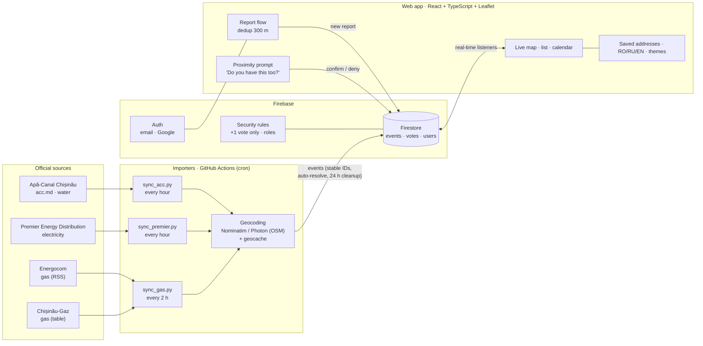
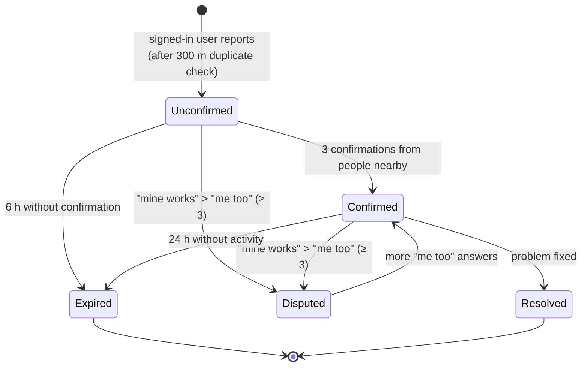

# Work In Progress — Pitch deck (DeepTech GigaHack, Open Challenge)

**Format:** 5 minutes · 7 slides · live demo on one slide

**The story in one line:** *The information already exists but doesn't reach people. We connected it, it's live today, and people told us they want it.*

| Part | What it proves |
|---|---|
| Hook + Problem | The problem is real: survey of 133 people |
| Problem | The information exists but is scattered: 4 official providers, 4 websites |
| Demo | We connected it, and it works right now with real data |
| How it works | You can trust it: clear, transparent verification rules |
| Impact | People want it: 91% useful, 83% would use it |
| Next step | It can grow: API-ready, more categories, more cities |

**The one-sentence description** (on the cover and the closing slide):

> **We offer a live outage map for people in Chișinău who find out about water, power and gas cuts too late, and we solve it by combining every provider's official announcements with reports confirmed by neighbours.**

### Timing

| Slide | Section | Time |
|---|---|---|
| 1 | Hook | 0:15 |
| 2 | Problem | 0:45 |
| 3 | Solution & live demo | 2:00 |
| 4 | How it works | 0:45 |
| 5 | Impact & next step | 0:45 |
| 6 | Team | 0:15 |
| 7 | Close | 0:15 |
| | **Total** | **5:00** |

---

## Survey — key numbers (n = 133, Chișinău)

| Question | Result |
|---|---|
| How do you usually find out about disruptions in the city? | Social media **42.1%** · Only when I hit the problem **33.1%** · Official announcements **12.8%** · Neighbours / acquaintances **12.0%** |
| How satisfied are you with the information you find? (n = 132) | Very satisfied 8.3% · Satisfied 45.5% · Dissatisfied 31.1% · Very dissatisfied 15.2% → **46.3% dissatisfied** |
| Would it be useful to see all outages, works and changes in one place, verified by the community? | Very useful 54.1% · Probably useful 36.8% → **90.9% useful** |
| How likely would you be to use such a service? | Very likely 38.3% · Likely 44.4% → **82.7% would use it** |

**Headline numbers for slides:** 1 in 3 find out only when they're hit · only 13% learn from official announcements · 46% dissatisfied · 91% useful · 83% would use it

---

## Slide 1 — Hook · 0:15

**On screen:** **1 in 3**
*small:* find out about city disruptions only when they're already hit (survey, n = 133)

**Say:**
> "We asked 133 people in Chișinău how they find out about outages and disruptions in their city. One in three said: *only when I run into the problem.*"

---

## Slide 2 — Problem · 0:45

**Title:** *The information exists. It doesn't reach people.*

**On screen:**
- A bar chart, "How do you find out about disruptions in the city?" Social media **42%** · Only when I hit the problem **33%** · Official announcements **13%** · Neighbours **12%**
- The 4 provider logos (Apă-Canal Chișinău · Premier Energy · Energocom · Chișinău-Gaz), captioned *"4 websites · 4 formats · no map"*
- *"46% are dissatisfied with the information they find"*

**Say:**
> "Official announcements do exist, but only 13% of people get their information from them. They're spread across four providers, published as tables of street names, and nothing tells you whether *your* address is affected. So people turn to Facebook groups, which are fast but unverified, or they find out when the tap runs dry. Almost half are unhappy with the information they get."

---

## Slide 3 — Solution & live demo · 2:00

**On screen:** the one-sentence pitch, the word **LIVE**, a QR code to the app, and *"Real data from 4 official providers · updated every hour"*.

**Say the bridging line, then switch to the app:**
> "Social media is fast but unverified. Official sources are verified but nobody sees them. We combine the two. This is running live right now, with real data."

**Demo script. Everything happens on the map, with no page changes. You should already be logged in:**

| # | Action | Say |
|---|---|---|
| 1 | The map opens on your location | "These are the real outages in Chișinău right now: **[N] events** from 4 providers. Blue is water, yellow is electricity, orange is gas, on the real streets." |
| 2 | Tap an official event | "Source: Apă-Canal Chișinău. Official start and end, time remaining, affected streets. This came in automatically. Nobody typed it." |
| 3 | Saved addresses | "I can see right away whether my home, my office or my parents' flat is affected." |
| 4 | Calendar → tap a day | "Planned cuts for the coming days, so you can prepare before they happen." |
| 5 | Report → second phone asks "Do you have this problem too?" → 3rd confirmation | "When a neighbour is nearby, the app asks them to confirm. After 3 confirmations the report goes public, live, for everyone." |
| 6 | Switch RO → RU → EN | "Available to the whole city, in all three languages." |

**Close the demo with:**
> "What changes: instead of checking four websites or finding out too late, you know ahead of time whether you're affected, for how long, and whether your neighbours are affected too."

---

## Slide 4 — How it works · 0:45

**Title:** *Official data + neighbour verification*

**On screen (slide version of the diagram):**

```
4 official sources ──► automatic importers (hourly; every 2 h for gas)
                        parse → locate on real streets (OpenStreetMap)
                               │
                               ▼
Citizen reports ─────► real-time database ─────► live map (web, mobile-first)
```

**Trust rules on the slide:**
- 🛡 **Official:** published immediately, source named
- ⏳ **Unconfirmed:** a new report shows right away with a dotted outline, so neighbours can check it
- 👥 **Confirmed:** after **3 × "Me too"** from people within **100 m**, one answer per device. Signed-in users who walk within 50 m are asked "Do you have this problem too?"; anyone can also answer on the event page
- ❓ **Disputed:** if at least **3 people answer "No, mine works"** and they outnumber the "Me too" answers, the report is **taken off the map**. Example: 1 yes / 3 no → removed; 4 yes / 3 no → stays confirmed. False alarms and pranks correct themselves, with no moderator.
- ⏱ **Expires automatically:** after 6 h if unconfirmed, 24 h if there's no further activity
- 🔁 **No duplicates:** the app checks for similar reports within 300 m

**Say:**
> "Two sources, one set of rules. Official data comes in automatically. Citizen reports only become public once neighbours on the spot confirm them. Every rule is a setting we can tune as real usage comes in."

---

## Slide 5 — Impact & next step · 0:45

**Title:** *People asked for this*

**On screen:** **91%** would find it useful · **83%** would use it *(n = 133, Chișinău)*

**Who benefits:**
- **Residents:** 4 sources become 1 map, with warnings for your own addresses, ahead of time
- **Providers:** a verified early signal of where an unannounced breakdown is and how big it is
- **City Hall:** one public, verified picture of disruptions across the city

**What we measure:** % of users who knew about a cut *before* it happened (today: 1 in 3 find out only once they're hit) · official data online in ≤ 1 h · time until a report is confirmed

**Next step, i.e. what happens on Monday:**
1. Providers publish a simple structured feed (API) instead of us reading their websites. Our importers are ready.
2. Push notifications for saved addresses
3. More categories (roads, public transport, urban works; the data model already supports them), then other cities

---

## Go-to-market (slide 8 in the deck · ~20 s, or keep for Q&A)

**Title:** *Two ways to reach Chișinău.* Both use the same engine and the same data: official feeds plus neighbour confirmations.

| | **B2G: Municipality** | **B2C: Freemium Telegram bot** |
|---|---|---|
| Offer | The city's official all-in-one outage map, under City Hall's brand, for its 720K residents | A daily outage forecast in Telegram |
| What users get | One trusted place for water, power and gas; best user experience | **Free:** every morning, what's off today at your address, plus next week's planned cuts, so there are no surprises. **Premium:** several addresses (home, parents, office) and instant alerts when a breakdown is confirmed nearby |
| Value for the buyer | Municipal providers (e.g. Apă-Canal) publish directly; a live picture of breakdowns across the city; fewer hotline calls | Users pay for convenience and peace of mind |
| Status | Proposal | Concept, not built yet; premium features are a proposal |

**Say:**
> "We see two ways to market, on the same engine. B2G: City Hall offers this as the city's official outage map, with municipal providers publishing straight into it. B2C: a freemium Telegram bot that sends you a daily forecast for your address and next week's planned cuts, so there are no surprises."

---

## Slide 6 — Team · 0:15

Five members. **[Name]: [role]**, one line each.

> "We built all of this during the hackathon, from scratch, and [names] will keep working on it after the weekend."

---

## Slide 7 — Close · 0:15

**On screen:** the one-sentence description, a large QR code with *"Jury, test it on your phone"*, and the **Work In Progress** logo. Leave it up during Q&A.

**Say:**
> "One in three people find out about outages only when they're already hit. We built one live map, verified by official sources and by neighbours, so they can find out ahead of time. We're Work In Progress. Thank you."

---

## Appendix A — Architecture

### Detailed diagram



### Components

| Layer | Technology | Role |
|---|---|---|
| Official data | Python importers on GitHub Actions (cron) | Read the 4 provider websites, parse addresses and intervals, give each event a stable ID, mark events resolved when they disappear from the source, delete them 24 h after they're resolved |
| Geocoding | OpenStreetMap (Nominatim, Photon) + cache | Turn "street + building numbers" into points and affected zones on real streets |
| Backend | Firebase Firestore + Auth + security rules | Real-time database (`events`, `votes`, `users`), email / Google sign-in, votes limited to +1 at the database level |
| Front-end | React, TypeScript, Leaflet, CARTO / OSM tiles | Live map, list, calendar, reporting, proximity confirmation, saved addresses, RO/RU/EN, light / dark themes |
| Operations | GitHub Actions CI (typecheck + build), Vercel | Every push to `main` is checked and deployed |

### Why it scales

- **New provider = one new importer.** Every importer writes the same event format.
- **New category or city = configuration.** Categories, colours, thresholds and map bounds live in config files (`src/config/`).
- **API-ready.** The app reads through a service layer (`EventsService`), and the data is already structured. Providers can push a feed, and third parties (City Hall, media, bots) can read one.

---

## Map colours (same in the app and the deck)

| Look | Meaning |
|---|---|
| 🔴 Red | **Full outage**: no water, power or gas at these addresses |
| 🟡 Yellow | **Partial**: only some buildings, or low pressure: you may be affected |
| Diagonal stripes | **Resident report** (same red / yellow); plain = official notice from the provider |
| Dotted outline | Resident report still **unconfirmed** (needs 3 × "Me too"); expires after 6 h |
| Grey | Resolved or expired |
| Icon | Type: drop = water, bolt = power, flame = gas |

On the map, the circle around each address has a solid line for official notices and a dotted line for resident reports.

---

## New way to report: Telegram bot (working prototype)

1. `/login` links Telegram to your account once (a one-time link that expires in 10 minutes).
2. `/raporteaza`: choose water, gas or electricity.
3. "Happening now", or pick a start date from the calendar.
4. Send your location. The report lands on the same map, under the same confirmation rules.

The daily outage forecast in Telegram is still a concept.

---

## Appendix B — Trust rules

### Event statuses

| Status | Where it comes from | Visible on the public map | Marker |
|---|---|---|---|
| 🛡 **Official** | Provider announcement (imported automatically) | Yes, immediately | Filled + shield, source named |
| 👥 **Confirmed** | Citizen report with ≥ 3 confirmations | Yes | Filled + number of neighbours |
| ⏳ **Unconfirmed** | New citizen report | Yes, so neighbours can confirm it | Dotted outline |
| ❓ **Disputed** | ≥ 3 "No, mine works" answers, and more than the "Me too" answers | No, taken off the map | Faded + "?" |
| ✅ **Resolved / Expired** | Removed from source, ended, or timed out | No (history only) | Grey |

### Rules and thresholds

| Rule | Value | Why |
|---|---|---|
| Confirmations to become "Confirmed" | **3** | One person can't make a report credible alone. A few neighbours are enough to be quick. |
| Who can vote | Only within **100 m**, checked by GPS | Only people who can actually see the problem |
| When the app asks "Do you have this too?" | Signed-in users within **50 m** of a report (grows with GPS inaccuracy, max. +100 m) | Asks the right people at the right moment, with no searching |
| Votes per person | **One per device**, no account needed | Confirming is effortless, and it's still hard to game |
| Who can report | Signed-in users only (email / Google) | Accountability for new reports |
| Disputed | "No, mine works" > "Me too", **min. 3** | False alarms and pranks leave the map without a moderator |
| Duplicate check | Similar reports within **300 m** shown before posting | One problem → one report with more confirmations |
| Expiry, unconfirmed | **6 h** | Stale, unverified reports disappear |
| Expiry, confirmed with no activity | **24 h** | The map shows the present, not old news |
| Affected address | Saved address within **250 m** of an event | Personal "you're affected" signal |
| Map horizon | In progress + next **48 h**; the rest is in the calendar | Map stays readable; planning happens in the calendar |

All thresholds are in one file (`src/config/constants.ts`) and can be tuned with real usage data.

### Lifecycle of a citizen report



---

## Appendix C — Before going on stage

- [ ] The morning of the pitch, count the live events on the map and put the number in slide 3 **[N]**
- [ ] Log in on both phones and seed one report with 2 confirmations, so the 3rd confirmation happens live on stage
- [ ] Have a screen recording of the demo on the laptop as a backup
- [ ] Turn the zoom and font size up so the back row can read the screen
- [ ] Put the QR code to the live app on slides 3 and 7
- [ ] Fill in the team names and roles (slide 6)

---

## Appendix D — Likely jury questions

| Question | Answer |
|---|---|
| What if a provider's website changes? | Each importer runs on its own and fails safely: one broken source doesn't affect the others. The long-term fix is an official feed from the provider. |
| How do you stop fake reports? | A report needs an account, 3 confirmations from people physically nearby, one vote per device, a Disputed status, and automatic expiry. Vote limits are also enforced by the database rules. |
| GDPR / privacy? | Location is used on the device only to check distance. There's a cookie consent banner, a privacy policy, and users can delete their reports and their account. |
| How does it scale? | Adding a provider means adding one importer. Adding a category or a city means changing configuration, not rewriting the app. |
| Why would providers join? | They get a verified early signal about unannounced breakdowns and fewer duplicate calls, and publishing a feed costs them almost nothing. |
| What does it cost to run? | Serverless: scheduled importers on GitHub Actions, Firebase and static hosting. Cost grows with usage, not with a fixed server. |
